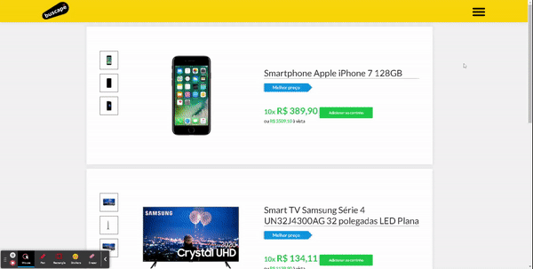

<h1 align="center">Buscapé Challenge</h1>

<h1 align="center"></h1>

## ✨ Technologies

This project has been setted with the following technologies:

- [React](https://reactjs.org/)
- [React DOM](https://pt-br.reactjs.org/docs/react-dom.html)
- [Create REACT-APP](https://github.com/facebook/create-react-app)
- [TypeScript](https://www.typescriptlang.org/)
- [Redux](https://react-redux.js.org/)
- [Styled-components](https://www.styled-components.com/)
- [ESLint](https://eslint.org/)
- [EditorConfig](https://editorconfig.org/)

## 💻 Project

React e-commerce application based on "Buscapé" web site, you can move items to your cart and remove them, if you move the same item you already moved to the cart, it will count 1 more in quantity property, you can also remove them 1 by 1.

## 🔧 Technologies choice

 Project developed using React library to make it an Single Page Application, which guarantee the best perform once its running directly in the clients browser, Create React App tool to configure the environment, TypeScript as the language to ensure values from props and states as the expected from contract, Redux as the global context state management, Styled components to avoid unnecessary style to components and conflicting ones, Atom model as the design pattern to promote clean maintenance and good practice of coding in accordance with ESLint and EditorConfig, configuration modules which automatically update the code to a pattern clean code.
## 🎯 Challenge

This project is based on the [buscape-company-front-end](https://github.com/buscape-company/exercicios/tree/master/frontend) challenge, and proposed by [Pedro Leão](https://github.com/pleaobraga) using React and Redux.

## 🚀 How to run

Clone this repository.
```bash
# Run to install dependencies.
$ yarn

# Run to start the project on `localhost:3000`.
$ yarn start
```

## 🚧 How to build

Clone this repository.
```bash
# Run to install dependencies.
$ yarn

# Run to start building the project.
$ yarn build

# Builded project it´s now available at folder `root/build`
```

## 💎 Next steps

- API to register the products in a database, instead an mock JSON file.
- Unique product page using React Router Dom.
- Alternative layout to the different screen sizes.
